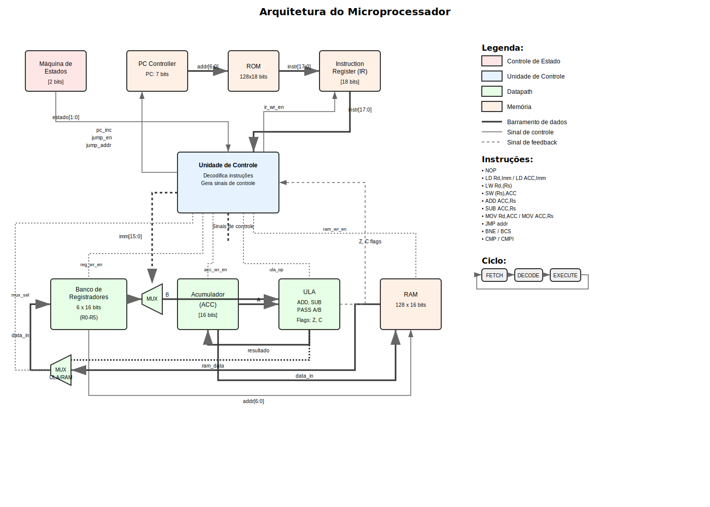

# Microprocessador em VHDL - Implementação do Crivo de Eratóstenes

Este projeto implementa um microprocessador simples em VHDL capaz de executar o algoritmo do Crivo de Eratóstenes para encontrar números primos. O processador possui uma arquitetura com acumulador e banco de registradores.

## 📋 Visão Geral

O microprocessador implementa uma CPU de 16 bits com as seguintes características:

- **Arquitetura**: ULA com acumulador
- **Largura da instrução**: 18 bits
- **Banco de registradores**: 6 registradores (R0-R5)
- **Memória RAM**: 128 posições de 16 bits
- **Ciclo de execução**: Fetch → Decode → Execute

## 🏗️ Arquitetura do Sistema



O microprocessador é composto pelos seguintes componentes principais:

### Componentes Principais

1. **Unidade de Controle** (`unidade_controle.vhd`)
  - Controla o fluxo de execução das instruções
  - Implementa máquina de estados de 3 estados

2. **Datapath Core** (`ula_acc_bank.vhd`)
  - ULA (Unidade Lógica e Aritmética)
  - Acumulador
  - Banco de registradores

3. **Memórias**
  - **ROM** (`rom.vhd`): Armazena o programa (128 posições × 18 bits)
  - **RAM** (`ram.vhd`): Memória de dados (128 posições × 16 bits)

4. **Registradores Especiais**
  - **PC** (Program Counter): Contador de programa
  - **IR** (Instruction Register): Registrador de instrução

5. **Máquina de Estados** (`maquina_estados.vhd`)
  - Controla os ciclos Fetch, Decode e Execute

## 🔧 Set de Instruções

### Codificação de Instruções

A instrução possui 18 bits organizados da seguinte forma:
MSB [17:14] [13:10] [9:0] LSB
Opcode   Campo   Dados

### Instruções Implementadas

| Opcode | Mnemônico | Descrição | Formato |
|--------|-----------|-----------|---------|
| `0000` | **NOP** | Nenhuma operação | `0000 0000 0000 0000 00` |
| `0001` | **LW** | Carrega da memória | `0001 0ddd 0000 000sss` |
| `0010` | **ADD** | Soma com acumulador | `0010 0000 0000 000sss` |
| `0011` | **SUB** | Subtrai do acumulador | `0011 0000 0000 000sss` |
| `0100` | **LD** | Carrega constante | `0100 fddd cccccccccc` |
| `0101` | **MOV** | Move ACC para registrador | `0101 0ddd 0000 0000 00` |
| `0110` | **SW** | Armazena na memória | `0110 0000 0000 000sss` |
| `0111` | **MOV** | Move registrador para ACC | `0111 0000 0000 000sss` |
| `1000` | **CMP** | Compara registrador com ACC | `1000 0000 0000 000sss` |
| `1001` | **CMPI** | Compara imediato com ACC | `1001 0000 cccccccccc` |
| `1101` | **BNE** | Salta se não igual | `1101 01aa aaaaaaa 00` |
| `1110` | **BCS** | Salta se carry set | `1110 01aa aaaaaaa 00` |
| `1111` | **JMP** | Salto incondicional | `1111 00aa aaaaaaa 00` |

### Campos da Instrução

- **ddd**: Registrador destino (3 bits: R0-R5)
- **sss**: Registrador fonte (3 bits: R0-R5)
- **cccccccccc**: Constante/imediato (10 bits)
- **aaaaaaa**: Endereço de salto (7 bits)
- **f**: Flag de destino (0=registrador, 1=acumulador)

## 🎯 Programa Exemplo: Crivo de Eratóstenes

O processador executa automaticamente o algoritmo do Crivo de Eratóstenes, que encontra todos os números primos até 33.

### Algoritmo Implementado

1. **Inicialização**: Preenche a RAM (posições 0-33) com valor 1
2. **Crivo**: Para cada número primo encontrado:
   - Marca todos os seus múltiplos como não-primos (valor 0)
   - Avança para o próximo número não marcado

### Código Assembly

```assembly
; Seção 1: Preenchimento da RAM
0:  LD R0, 0        ; R0 = 0 (contador)
1:  SW (R0), ACC    ; mem[R0] = ACC
2:  LD ACC, 1       ; ACC = 1
3:  ADD R0          ; ACC = ACC + R0
4:  MOV R0, ACC     ; R0 = ACC
5:  CMPI 33         ; Compara ACC com 33
6:  BNE 1           ; Se ACC != 33, volta para 1

; Seção 2: Crivo de Eratóstenes
8:  LD R2, 2        ; R2 = 2 (primeiro primo)
9:  LD R3, 32       ; R3 = 32 (limite)
10: LD R4, 33       ; R4 = 33 (limite geral)
...

```

## 🚀 Como Usar

### Simulação

1. Compile todos os arquivos VHDL em sua ferramenta de simulação
2. Execute a simulação do módulo `microprocessador`
3. Observe as saídas de debug:
  - `debug_pc_addr`: Endereço atual do PC
  - `debug_ir_instr`: Instrução atual
  - `debug_acc_out`: Valor do acumulador
  - `debug_reg_bank_out`: Valor do registrador sendo lido

### Sinais de Debug

O microprocessador fornece várias saídas para debug e monitoramento:

```vhdl
debug_fsm_estado     : Estado da máquina (Fetch/Decode/Execute)
debug_pc_addr        : Endereço do Program Counter
debug_ir_instr       : Instrução atual no IR
debug_reg_bank_out   : Saída do banco de registradores
debug_acc_out        : Valor do acumulador
debug_ula_out        : Resultado da ULA

📁 Estrutura dos Arquivos
├── microprocessador.vhd      # Módulo principal
├── unidade_controle.vhd      # Unidade de controle
├── ula_acc_bank.vhd         # Datapath (ULA + ACC + Banco)
├── maquina_estados.vhd      # Máquina de estados FSM
├── pc_rom.vhd               # Interface PC-ROM
├── pc_controller.vhd        # Controlador do PC
├── pc.vhd                   # Program Counter
├── instruction_register.vhd  # Registrador de instrução
├── accumulator.vhd          # Acumulador
├── register_bank.vhd        # Banco de registradores
├── reg16bits.vhd           # Registrador de 16 bits
├── ula.vhd                 # ULA (Unidade Lógica Aritmética)
├── rom.vhd                 # Memória ROM
├── ram.vhd                 # Memória RAM
├── assembly.txt            # Código assembly do programa
└── esquematico.svg         # Diagrama esquemático
⚙️ Requisitos Técnicos

Linguagem: VHDL
Simulador: ModelSim, GHDL, ou similar
Síntese: Quartus, Vivado, ou similar
Família FPGA: Compatível com Altera/Intel ou Xilinx

🎓 Objetivos Educacionais
Este projeto demonstra:

Arquitetura de microprocessadores
Pipeline de execução (Fetch-Decode-Execute)
Design de conjunto de instruções (ISA)
Implementação de ULA e banco de registradores
Controle de fluxo e saltos condicionais
Implementação de algoritmos em assembly

📝 Notas de Implementação

O processador usa aritmética unsigned de 16 bits
Flags de zero e carry são implementadas na ULA
Saltos condicionais são relativos ao PC atual
O programa do Crivo está hard-coded na ROM
A RAM pode ser observada durante a execução para ver os resultados

🔍 Resultados Esperados
Após a execução completa do algoritmo, a RAM conterá:

Posições com números primos: valor 1
Posições com números compostos: valor 0
O registrador R5 mostra o último primo encontrado

Os números primos encontrados até 33 são: 2, 3, 5, 7, 11, 13, 17, 19, 23, 29, 31.